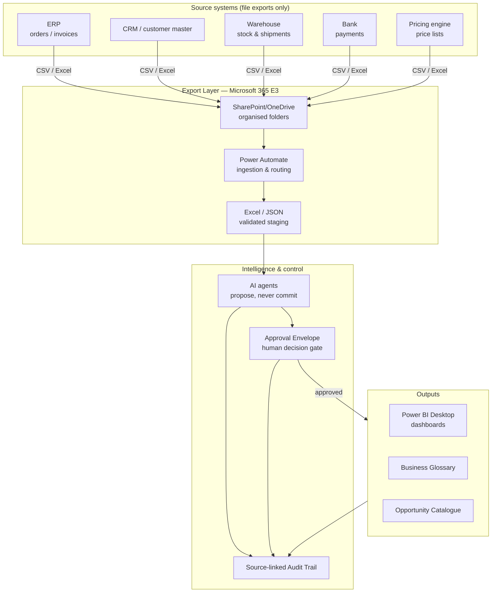
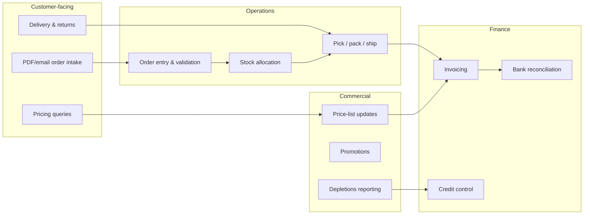
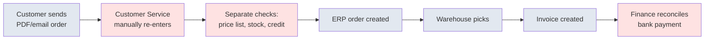
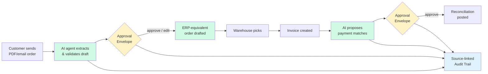
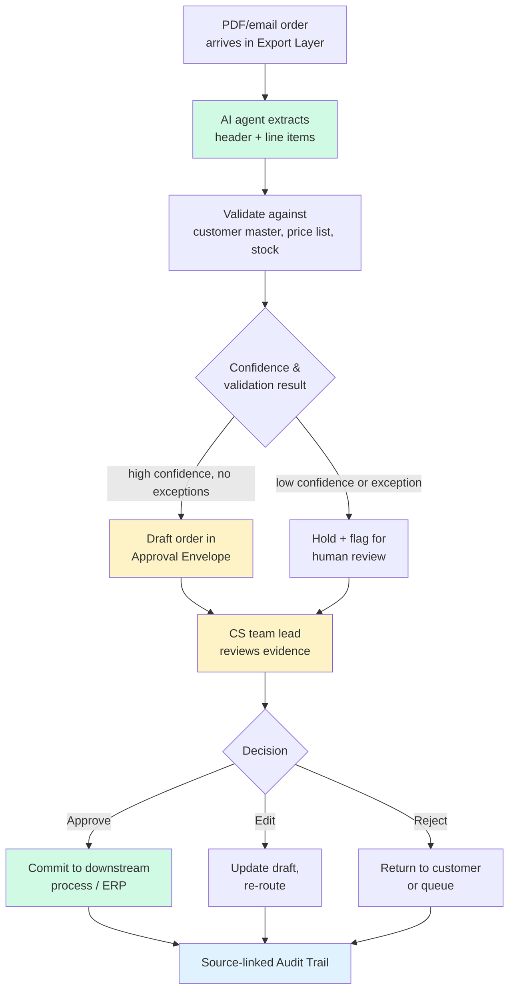
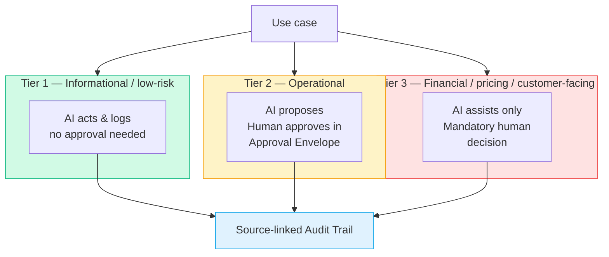
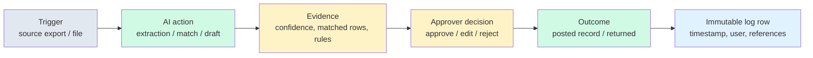
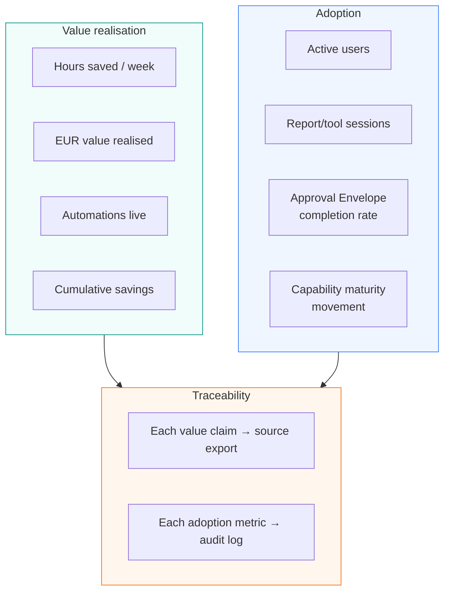

# Pre-call storyboard gallery — eight-core storyboard plus interactive walkthrough

> Rendered Mermaid diagrams for the core pitch storyboard described in `docs/03-mockup-pack.md`, a committed architecture PNG, and a single-file interactive walkthrough. The AI Steering Committee can see the value narrative **without running any prompts**.
>
> **Confidential — project team only.** All diagrams use neutral placeholders; no real company names, logos or live data. Every number shown is an **illustrative placeholder** — the real figures are sourced from client exports during Phase 0 / Wave 1 and recorded in the Source-linked Audit Trail.
>
> **Human in control:** these visuals exist to show that AI *proposes* and a named human *decides*. Nothing financial, pricing or customer-facing is ever auto-committed.

---

## How to view

Each diagram has an editable `.mmd` Mermaid source and a committed offline `.svg` render in `rendered/`.

- Interactive walkthrough: open [`walkthrough/index.html`](walkthrough/index.html) directly in a browser for the eight-screen click-through demo.
- Architecture PNG: open [`01-solution-architecture.png`](01-solution-architecture.png) for a deck-safe rendered fallback.
- Offline SVGs: open `assets/mockups/rendered/*.svg` directly in a browser or attach them to the deck.
- HTML companion screens: open [`html/README.md`](html/README.md) for app-like mockups covering the non-Mermaid prompts.
- Mermaid Live Editor: <https://mermaid.live>
- GitHub / GitLab markdown preview
- Any Mermaid CLI or VS Code plugin
- Regenerate SVGs/PNG with `python3 scripts/render_storyboard_mermaid.py`
- `assets/pitch/pitch-deck.md` references these files in speaking order

Each `.mmd` file carries a `%%` identity header naming the Angel Software Solutions engagement and the source prompt it was rendered from (`docs/03-mockup-pack.md`), so the storyboard itself is traceable.

---

## Storyboard order (pitch sequence)

| # | Visual | Source | Offline SVG | Steering-committee message |
|---|---|---|---|---|
| 1 | Solution architecture | [`01-solution-architecture.mmd`](01-solution-architecture.mmd) | [`rendered/01-solution-architecture.svg`](rendered/01-solution-architecture.svg) | The platform runs off your **exports**, stays inside **M365 E3**, and is unaffected by the pending ERP and BI decisions |
| 2 | Process landscape | [`03-process-landscape.mmd`](03-process-landscape.mmd) | [`rendered/03-process-landscape.svg`](rendered/03-process-landscape.svg) | Here is everything in scope, across customer, operations, finance and commercial — we go wave by wave |
| 3 | As-is order-to-cash | [`04-as-is-order-to-cash.mmd`](04-as-is-order-to-cash.mmd) | [`rendered/04-as-is-order-to-cash.svg`](rendered/04-as-is-order-to-cash.svg) | Here is where your time and errors go today (manual re-entry, fragmented checks) |
| 4 | To-be order-to-cash | [`05-to-be-order-to-cash.mmd`](05-to-be-order-to-cash.mmd) | [`rendered/05-to-be-order-to-cash.svg`](rendered/05-to-be-order-to-cash.svg) | The same process after redesign — AI drafts, **a human approves**, the audit trail captures it |
| 5 | Agent + Approval Envelope | [`07-agent-approval-envelope.mmd`](07-agent-approval-envelope.mmd) | [`rendered/07-agent-approval-envelope.svg`](rendered/07-agent-approval-envelope.svg) | A worked example of human-in-the-loop control on one operational decision |
| 6 | Governance tiers | [`10-governance-tiers.mmd`](10-governance-tiers.mmd) | [`rendered/10-governance-tiers.svg`](rendered/10-governance-tiers.svg) | Risk-based control: act-and-log, propose-and-approve, or assist-only — nothing financial is ever automated |
| 7 | Source-linked Audit Trail | [`11-source-linked-audit-trail.mmd`](11-source-linked-audit-trail.mmd) | [`rendered/11-source-linked-audit-trail.svg`](rendered/11-source-linked-audit-trail.svg) | Every figure traces back to its source export and its approver *(answers Cesar's "tip of the iceberg" point)* |
| 8 | Value & adoption dashboard | [`16-value-adoption-dashboard.mmd`](16-value-adoption-dashboard.mmd) | [`rendered/16-value-adoption-dashboard.svg`](rendered/16-value-adoption-dashboard.svg) | How we prove it worked — measured savings **and** adoption, both traceable |

> The pitch has **eight core storyboard visuals** and can still be delivered as seven spoken beats by pairing the agent Approval Envelope with governance tiers. The interactive walkthrough mirrors the eight-screen client demo flow.

---

## The visuals

### 1. Solution architecture — *"It runs off your exports."*

**Message:** sources stay where they are; files export into a governed Export Layer inside Microsoft 365 E3; AI and reporting sit downstream of a human gate. The platform is unaffected by the ERP migration and the BI-platform choice.

**Source / audit trail:** conceptual diagram — no client figures. Rendered from `docs/03-mockup-pack.md` prompt #1. Source systems shown (ERP, CRM, Warehouse, Bank, Pricing) are neutral placeholders to be confirmed against the Phase 0 export inventory.

---

### 2. Process landscape — *"Here is everything in scope."*

**Message:** the full cross-department picture — customer-facing, operations, finance and commercial — and how order-to-cash threads through them. We work it wave by wave, not all at once.

**Source / audit trail:** conceptual scope map rendered from prompt #3. The process inventory is illustrative and is confirmed in the Phase 0 process-landscape workshop before any work is scheduled.

---

### 3. As-is order-to-cash — *"Here is where your time goes today."*

**Message:** the current state. Steps in **red** are manual, duplicated or error-prone — re-keying orders by hand, checking price/stock/credit in separate places, reconciling payments manually.

**Source / audit trail:** the as-is map is drawn from Phase 0 process-mapping interviews and observation, not from a system export. Any "time lost / error rate" figures quoted alongside it on a slide are **illustrative placeholders** until the Wave 1 baseline measurement is captured and logged.

*(Red = manual / error-prone step. The semantic red/green used in the as-is and to-be maps sits within the Angel Software Solutions palette family — colour is used only to carry the "pain vs. automated" message.)*

---

### 4. To-be order-to-cash — *"The same process, redesigned — and a human still approves."*

**Message:** AI extracts and validates the order into the Export Layer; **green** steps are automated drafting; the **amber diamonds are Approval Envelopes** where a named human reviews before anything is committed. Every step also writes to the Source-linked Audit Trail.

**Source / audit trail:** rendered from prompt #5. Any "hours saved per week" annotations are **illustrative placeholders** — the real before/after is measured against the Wave 1 baseline and recorded per task in the value tracker (`docs/04-templates/`) and the audit log.

---

### 5. AI agent inside an Approval Envelope — *"AI proposes, your people decide."*

**Message:** a worked example of one operational decision. The agent extracts and validates, but high *and* low confidence both route to a **human reviewer** who can approve, edit or reject. Only on approval is anything committed — and the decision is logged.

**Source / audit trail:** rendered from prompt #7. The validation references (customer master, price list, stock) are neutral placeholders mapped to the Phase 0 export inventory; the reviewer is a named Customer Service team lead, not the AI.

---

### 6. Human-in-the-loop governance tiers — *"Nothing financial is ever automated."*

**Message:** the control model in one frame. Tier 1 (informational) may act and log; Tier 2 (operational) is propose-and-approve via the Approval Envelope; Tier 3 (financial / pricing / customer-facing) is a **mandatory human decision** — AI assists only. All three tiers write to the audit trail.

**Source / audit trail:** rendered from prompt #10. The tier definitions are the engagement's governance standard (see `docs/04-templates/` governance tiers + approval-envelope templates); no client data is shown.

---

### 7. Source-linked Audit Trail — *"Every number traces back to its source."*

**Message:** the trust clincher. Each action leaves a trace from the trigger export, through the AI action and the evidence shown to the approver, to the approver's decision and an immutable log row. This directly answers the "Power BI is just the tip of the iceberg" concern: the value is the traceability underneath.

**Source / audit trail:** rendered from prompt #11. On a live slide the headline figure (e.g. *"Net sales — May 2026: €X.Xm"*) would expand to its lineage — source export filename + sheet + cell range, export date, transformation applied, who/what produced it, and the approval record. The €X.Xm is an **illustrative placeholder**; the real figure would cite an export such as `net_sales_2026-05.xlsx` once Phase 0 confirms the source.

---

### 8. Value & adoption dashboard — *"Here is how we prove it worked."*

**Message:** the success-metrics view. The top half is value realised (hours saved, EUR value, automations live, cumulative savings); the bottom half is adoption (active users, tool usage, Approval Envelope completion, capability maturity). Crucially, every value claim links to a source export and every adoption metric links to the audit log.

**Source / audit trail:** rendered from prompt #16. All KPI values are **illustrative placeholders** — in delivery they are populated from the value tracker and the Source-linked Audit Trail, never hand-entered, so the savings are auditable rather than asserted.

---

## Notes for the operator

- **Illustrative only.** Swap the sample order-to-cash flow, source systems and any quoted figures for Top Spirit's real processes and exports once the introductory call confirms scope and data sources. The `.mmd` files are the editable masters.
- **Human-in-control is the spine.** Beats 4, 5 and 6 all hinge on a named human approver; beat 7 makes the decision auditable; beat 8 makes the value auditable. Keep that framing in the room.
- **Identity & traceability.** Each `.mmd` carries an Angel Software Solutions identity + source header. Palette: teal `#0D9488`, navy `#0F172A`, off-white `#F8FAFC`, with semantic red/green/amber reserved for the as-is/to-be and governance maps to carry meaning.

---

*Generated from the mockup prompts in `docs/03-mockup-pack.md`, using the context block in `assets/angel-context-block.md`. Angel Software Solutions — Export Layer · Approval Envelope · Source-linked Audit Trail.*
