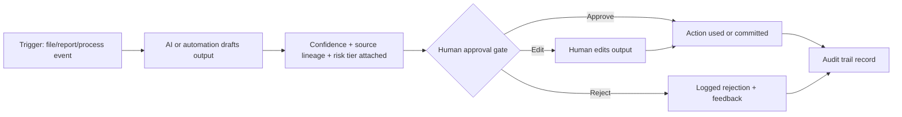

# Wave 1 — Governance model and Approval Envelopes

> AI may propose, draft, extract, classify or recommend. Humans approve every financial, pricing and customer-facing action.

## Three governance tiers

| Tier | Risk | AI/automation permission | Examples | Approver |
|---|---|---|---|---|
| G1 | Informational / low risk | May draft, summarise, classify or log automatically inside audit trail. | Summarise process notes, classify non-sensitive exports, draft glossary candidate. | Artifact owner review as needed. |
| G2 | Operational | AI proposes; named human approves before operational use. | Order-field extraction, stock exception routing, report refresh issue triage. | Process owner/BICC. |
| G3 | Financial, pricing or customer-facing | AI assists only; mandatory human decision and audit sign-off before use. | Pricing changes, finance postings, customer emails, credit decisions, reconciliation posting. | Finance/commercial owner plus escalation where needed. |

## Approval Envelope flow

## Approval record fields

| Field | Purpose |
|---|---|
| Envelope ID | Stable ID for the approval event. |
| Trigger/source IDs | Export/report/interview IDs. |
| Proposed action | What AI/automation suggested. |
| Risk tier | G1/G2/G3. |
| Confidence/exception flags | Why review is needed. |
| Approver | Named role/person. |
| Outcome | Approved, edited, rejected, escalated. |
| Timestamp | When decision was made. |
| Downstream action | What changed, if anything. |

## Steering committee decisions needed

- Confirm risk-tier examples.
- Confirm approver roles by department.
- Confirm escalation for disputed outputs or unauthorised data exposure.
- Confirm whether any G1 actions may be auto-logged without per-item review.
